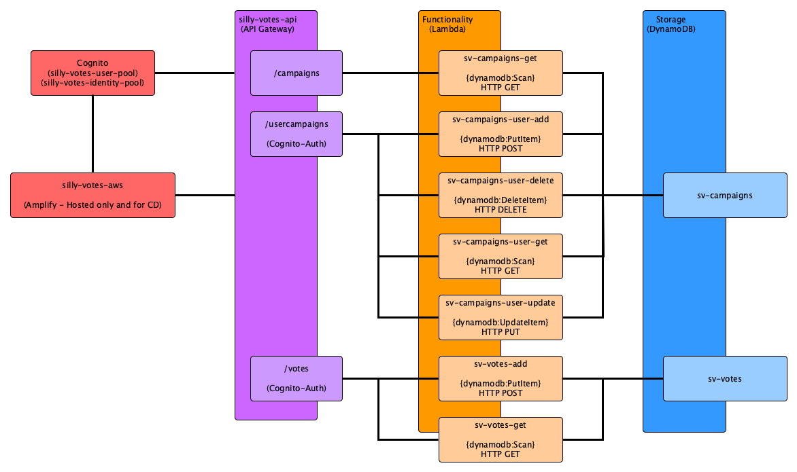

# Silly Votes (AWS)

Self exercise to create Silly Votes (again) but using AWS Lambdas and other services.

At the time of writing, attempts are being made to build the site from scratch and using only the Amplify libraries.

While Amplify can be used to create Lambdas, etc., it is **very** opinionated and appeared to resist attempts to trim down and simplify some features (e.g.: letting me set the IAM permissions of individual Lambda).

## General Design

The diagram below shows the planned goal of Silly Votes on AWS.  Despite its name, the design of Silly Votes is anything but.

Unlike the Docker version, authentication is done by a separate service (as I should have done in the first place!), in this case, AWS Cognito.

It was planned to use federated logins but due to inexperience, it could not be worked out why it failed thus direct calls to the API for signup and signin are used instead.

At the time of writing, login is possible but signup is not - that is being implemented.

In general, Silly Votes is comprised of:

* A single React front-end hosted via Amplify.
* A single back-end via API Gateway.
* A collection of Lambda functions (each with specific IAM roles for reading or writing data)
* Two DynamoDB collections.

## React Front-end (Amplify)

* Web site comprised of React, Material UI and (eventually) redux.
* In theory is the primary point of contact for all users.
* Communicates with Cognito to signup and signin users.

## Front-end API (API Gateway)

* The single access point for the React front end.
* Allows unauthenticated access to select methods.
* All other methods require authentication.
* Authenication and verification of said authentication delegated to Cognito.
* Was planned to the main front end for three seprate APIs.
    * Original plan was to have one API for campains, one for usercampaings, and one for votes.
    * Due to inexperience, it could not be worked out how to add other APIs via the proxy feature.
    * As a compromise, the paritioning is now done via "resources" in silly-votes-api.

## Functionality (Lambda)

* Effectively how the Web API gets its functionality.
* Functionality planned out as per REST APIs and IAM roles used to further limit what each function can do to the respective DynamoDB documents.
* Unless stated otherwise, all Lambdas make use of Cognito to get user identity information to further limit the scope of data being worked with.
    * E.g.: Those that delete can only delete and those that read can only read.  There are no read **and** write Lambdas at this time.

### sv-campaigns-get

* Effectively the **only** public function in the whole system.
* Allows users to see a list of all running campaigns.
* Can only **scan** DynamoDB documents.

### sv-campaigns-user-add

* Adds a new user campaign.
* Always adds a new campaign with the email of the user found in the claims provided by Cognito.
* Can only **put** items into DynamoDB documents.

### sv-campaigns-user-delete

* As the name implies, it removes a campaign.
* While an ID is specified in the URL path (as per REST), all operations are limited to data matching on the users's email address.
* Can only **delete** from DynamoDB documents.

### sv-campaigns-user-get

* As the name implies, it gets all campaigns the currently logged in user has created.
* Goes against REST to a degree in that instead of getting identity information from the URL path, it matches on the email address of the currently logged in user.
    * This is to prevent one user from reading the data of another user.
    * While limited to reading, data leaks are still just as bad as data destruction events.
* Can only **scan** from DynamoDB documents.

### sv-campaigns-user-update

* As the name implies, it allows a user to update a campaign.
* Like other methods, the data scope is limited to the email address of the currently logged in user.
* Can only **update** DynamoDB document items.

### sv-votes-add (Planned)

* Like sv-campaigns-user-add, this Lambda adds a vote "cast" by the currently logged in user.
* Also like sv-campaigns-user-add, the vote is marked by the email of the currently logged in user.
* Can only **put** items into DynamoDB documents.

### sv-votes-get (Planned)

* Basically gets the current vote tally for a given campaign.
* Can only **scan** DynamoDB documents.

## Storage (DynamoDB)

* Currently there are only two DynamoDB documents.
* **sv-campaigns** where all information about campaigns is kept, and
* **sv-votes** where all cast votes are kept.
* It is planned to put a trigger on sv-votes so a winner is called when needed and the campaign in question locked.
   * E.g.: If candidate A has 45 votes, candidate B has 40 votes and there are only 4 votes remaining then candidate A can be declared the winner as even if B got all four remaining votes B will be 1 short.
